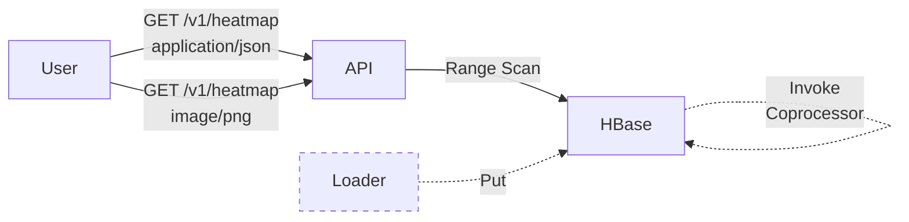

# Distributed Heatmap Service

Simple distributed heatmap service on top of Apache HBase

```mermaid
flowchart LR
    User -- GET /v1/heatmap\napplication/json --> API
    User -- GET /v1/heatmap\nimage/png --> API
    API -- Range Scan --> HBase
    HBase -. Invoke\nCoprocessor .-> HBase
    Loader -. Put .-> HBase
    style Loader stroke-dasharray: 5 5
```
